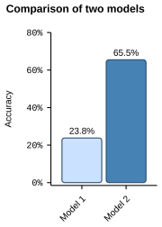

# Visualizations with R

Just some playground for visualizations with ggplot.   
Click on the images to enlage.

<table>
  <tr>
    <th colspan="2">Visualizations</th>
  </tr>
   <tr>
    <td colspan="2"><a href="plots/survival_kaplan_meier.svg">Kaplan-Meier Plot</a></td>
  </tr>
  <tr>
    <td valign="top" colspan="2">
      
    </td>
  </tr>
   <tr>
    <td colspan="2"><a href="plots/american_sentiment.svg">American Sentiment</a></td>
  </tr>
  <tr>
    <td valign="top" colspan="2">
      
    </td>
  </tr>
  <tr>
    <td colspan="2"><a href="plots/developer_age.svg">Developer Survey</a></td>
  </tr>
  <tr>
    <td valign="top">
      
    </td>
    <td valign="top">
      
    </td>
  </tr>
  <tr> 
    <td colspan="2"><a href="plots/penguin_weight.svg">Penguin Weights</a></td>
  </tr>
  <tr>
    <td valign="top">
        
    </td>
    <td valign="top">
      
    </td>
  </tr>
  <tr>
    <td colspan="2"><a href="plots/model_comparison.svg">Model Comparison</a></td>
  </tr>
  <tr>
    <td valign="top" colspan="2">
      
    </td>
  </tr>
 
</table>

## Installation

* Install [git lfs](https://git-lfs.com/).
* Install [just](https://github.com/casey/just).
* Clone the repository.
* Run `just init`.
