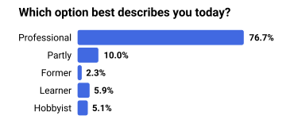

# Visualizations with R

<table>
  <tr>
    <th colspan="2">Visualizations</th>
  </tr>
  <tr>
    <td colspan="2">Discrete</td>
  </tr>
  <tr>
    <td valign="top"></td>
    <td valign="top"></td>
  </tr>
  <tr>
    <td colspan="2">Continuous</td>
  </tr>
  <tr>
    <td valign="top"></td>
    <td valign="top"></td>
  </tr>
</table>

## Installation

* Install [git lfs](https://git-lfs.com/).
* Install [just](https://github.com/casey/just).
* Clone the repository.
* Run `just init`.

# Resources

* [2024 Stack Overflow Developer Survey](https://www.kaggle.com/datasets/berkayalan/stack-overflow-annual-developer-survey-2024)
* [Palmer Penguins Dataset](https://allisonhorst.github.io/palmerpenguins/)
